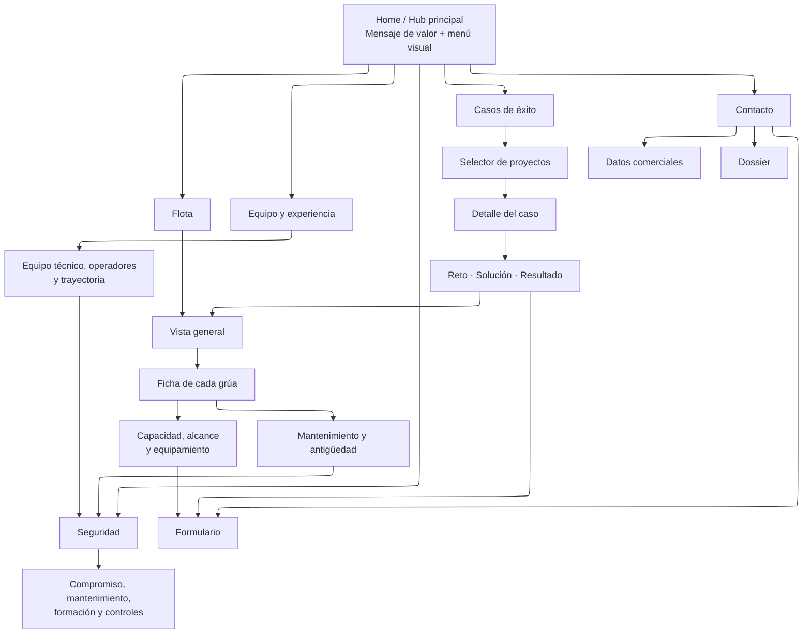

# Arquitectura de información

## Principio de navegación

La Home es el hub de la experiencia. Las cinco categorías se presentan como accesos visuales grandes; cada página debe conservar una salida visible a Inicio y a Contacto. Los enlaces transversales conectan evidencia con la acción siguiente, sin obligar a seguir un recorrido lineal.

## Límites de interfaz

- Un máximo de cinco accesos principales en la Home y una CTA primaria por pantalla.
- Cada sección se resuelve en una pantalla o en un panel breve, evitando scroll narrativo largo.
- La transición entre secciones debe responder de inmediato y durar poco; se omite con `prefers-reduced-motion`.
- Las fichas, PDFs y galerías se abren bajo demanda, sin cargar recursos pesados hasta que sean necesarios.
- Todos los controles serán navegables por teclado, tendrán etiqueta accesible y un estado de foco inequívoco.
- El vídeo será complementario: imagen de portada, reproducción manual y nunca información esencial exclusiva de vídeo.

## Páginas y contenido mínimo

| Página | Función | Contenido a validar | Enlaces prioritarios |
| --- | --- | --- | --- |
| Home | Situar la propuesta de valor y abrir el recorrido. | Titular, vídeo/foto principal, cinco categorías. | Todas las secciones. |
| Seguridad | Reducir el riesgo percibido. | Planificación, mantenimiento, formación y controles operativos. | Flota y Casos de éxito. |
| Flota | Demostrar capacidad y modernidad. | Catálogo, fichas, tonelaje, alcance, equipamiento, antigüedad y mantenimiento. | Seguridad y Contacto. |
| Equipo y experiencia | Acreditar solvencia humana y operativa. | Perfiles, habilitaciones, años de experiencia y cobertura. | Seguridad. |
| Casos de éxito | Convertir capacidad en evidencia real. | Reto, solución, recursos, medidas de seguridad y resultado. | Flota y Contacto. |
| Contacto | Cerrar la siguiente acción comercial. | Formulario, datos de contacto y dossier resumido. | Home y agenda comercial. |

## Reglas de contenido

- Publicar únicamente métricas, certificados y declaraciones que puedan demostrarse.
- Indicar la vigencia de cada certificación y sustituir documentos caducados.
- Anonimizar los casos si los clientes no autorizan identificarlos.
- Priorizar fotografías y vídeo propios de operaciones, flota y equipo.
- Mantener una ruta breve: Home → evidencia → contacto en tres interacciones o menos.
